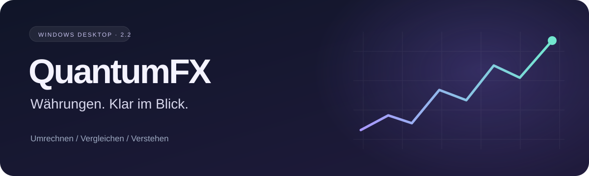

<div align="center">



**Dein Währungsrechner für den Windows-Desktop.**

Kurse vergleichen, Gebühren verstehen und Umrechnungen im Blick behalten.

[](https://github.com/Eric-Enterprise/QuantumFX-Currency-Intelligence-Platform/releases/tag/v2.2.0)


[](https://github.com/Eric-Enterprise/QuantumFX-Currency-Intelligence-Platform/actions/workflows/python-app.yml)

### [↓ QuantumFX.exe herunterladen](https://github.com/Eric-Enterprise/QuantumFX-Currency-Intelligence-Platform/releases/download/v2.2.0/QuantumFX.exe)

**Keine Installation. Kein Konto. Python bereits enthalten.**

[Alle Downloads](https://github.com/Eric-Enterprise/QuantumFX-Currency-Intelligence-Platform/releases/latest) · [Funktionen](#-was-quantumfx-kann) · [Schnellstart](#-in-einer-minute-startklar) · [Entwicklung](#-für-entwickler)

</div>

---

## ✨ Was QuantumFX kann

Eine ruhige, dunkle Oberfläche mit violetten und mintfarbenen Akzenten, abgerundeten Glasflächen und klar beschrifteten Icons. Animationen geben Rückmeldung und lassen sich jederzeit abschalten. Im Vollbild bleibt viel Platz für das Wesentliche; kleinere Fenster passen die Anordnung automatisch an.

| | Funktion | Dein Nutzen |
| :---: | :--- | :--- |
| 💱 | **Währungsrechner** | Verfügbare Währungspaare mit Dezimalrechnung umrechnen und direkt tauschen. |
| 📈 | **Kursdiagramme** | Historische Tageskurse für 30, 90 oder 365 Tage ansehen und Werte per Maus ablesen. |
| ⚖️ | **Gebührenvergleich** | Drei eigene Angebote mit prozentualen und festen Gebühren vergleichen. |
| ⭐ | **Favoriten & Suche** | Häufig verwendete Paare speichern und Währungen schnell finden. |
| 🗂️ | **Verlauf & Export** | Bis zu 1.000 Umrechnungen lokal behalten; Verlauf, Kurse und Diagrammdaten als CSV exportieren. |
| 📴 | **Gespeicherte Kurse** | Den zuletzt abgerufenen Kursstand auch ohne Verbindung verwenden. |
| 🐍 | **Snake Arcade** | Eine Pause einlegen: drei Geschwindigkeiten, flüssige Bewegung und lokaler Highscore. |

## 🚀 In einer Minute startklar

1. **[QuantumFX.exe herunterladen](https://github.com/Eric-Enterprise/QuantumFX-Currency-Intelligence-Platform/releases/download/v2.2.0/QuantumFX.exe)** und per Doppelklick öffnen.
2. **Betrag und Währungen wählen**, zum Beispiel `100` von EUR nach USD.
3. Bei Bedarf **Gebühren aufklappen** und eintragen.
4. **Umrechnen & speichern** anklicken. Das Ergebnis erscheint sofort und bleibt im lokalen Verlauf.

Für Kursdiagramme **Verlauf laden** wählen. Nach einem Wechsel des Währungspaars oder Zeitraums erneut laden.

> **Windows 10/11 · 64 Bit:** Kein Installer und keine separate Python-Installation erforderlich. Beim ersten Start kann das Entpacken einige Sekunden dauern. Die EXE ist nicht digital signiert. Getestet wurde auf Windows 11 x64; andere PCs wurden nicht separat geprüft.

### Downloads

| Datei | Inhalt |
| :--- | :--- |
| [**QuantumFX.exe**](https://github.com/Eric-Enterprise/QuantumFX-Currency-Intelligence-Platform/releases/download/v2.2.0/QuantumFX.exe) | Direkt ausführbare Windows-Anwendung. |
| [**Windows-Paket (.zip)**](https://github.com/Eric-Enterprise/QuantumFX-Currency-Intelligence-Platform/releases/download/v2.2.0/QuantumFX-2.2-Windows-x64.zip) | EXE, Anleitung, Prüfbericht und Lizenzhinweise. |
| [**SHA256-Prüfsummen**](https://github.com/Eric-Enterprise/QuantumFX-Currency-Intelligence-Platform/releases/download/v2.2.0/SHA256SUMS.txt) | Prüfsummen zum Abgleichen der Downloads. |

## ⌨️ Weniger klicken, schneller arbeiten

| Taste | Aktion |
| :--- | :--- |
| `Enter` | Im Rechner umrechnen |
| `Strg` + `F` | Währungssuche öffnen |
| `Strg` + `R` | Kurse aktualisieren |
| `Strg` + `S` | Ausgangs- und Zielwährung tauschen |
| `F11` | Vollbild ein- oder ausschalten |
| `Esc` | Vollbild verlassen und Snake pausieren |

**Snake:** Spielfeld anklicken, mit Pfeiltasten oder `WASD` steuern, mit der Leertaste pausieren und mit `Enter` neu beginnen. Beim Bereichswechsel pausiert das Spiel automatisch.

<details>
<summary><strong>Beträge, Gebühren und Rundung</strong></summary>

Beträge ohne Tausendertrennzeichen eingeben: `1234,56` oder `1234.56`. Negative Werte, Exponentialschreibweise, mehr als acht Nachkommastellen und Beträge über einer Billion werden abgewiesen.

Feste Gebühren gelten in der Ausgangswährung. Berechnet wird:

```text
(Betrag − Betrag × Prozent / 100 − Fixgebühr) × Zielkurs / Basiskurs
```

Nur die Anzeige wird gerundet (`ROUND_HALF_UP`); CSV-Dateien enthalten die ungerundeten Dezimalwerte. Der Gebührenvergleich verwendet für alle Angebote denselben Referenzkurs. Individuelle Wechselkursaufschläge sind nicht enthalten.

Eingetragene Gebühren bleiben auch beim Einklappen aktiv und werden entsprechend gekennzeichnet.

</details>

## 🌐 Welche Kurse du siehst

QuantumFX bezieht **Tagesreferenzkurse über Frankfurter v1 / EZB**. Beim geprüften Online-Abruf standen 30 Währungen zur Verfügung; der tatsächliche Umfang hängt vom Anbieter ab. Es handelt sich um Referenzwerte, nicht um Echtzeitkurse oder garantierte Bankangebote. An Wochenenden und Feiertagen kann das Kursdatum zurückliegen.

| Status | Bedeutung |
| :--- | :--- |
| **Online** | Validierte Daten mit dem tatsächlichen Kursdatum. |
| **Offline / gespeicherte Kurse** | Der letzte lokal gespeicherte Stand; dieser kann älter sein. |
| **DEMO** | Undatierte Beispielwerte zum Ausprobieren, auch in Verlauf und CSV als DEMO gekennzeichnet. |

Diagramme zeigen ausschließlich abgerufene oder gespeicherte historische Daten. Fehlende Daten werden nicht erfunden.

## 🔒 Deine Daten bleiben übersichtlich

**Kein Konto, keine Telemetrie, keine Broker-Verbindung.** Beträge und Umrechnungsverlauf werden nicht an den Kursanbieter übertragen. Kursabfragen enthalten Währungen, Zeiträume und normale Verbindungsdaten.

Die Anwendung speichert ihre Daten unter `%LOCALAPPDATA%\QuantumFX`. Die EXE benötigt keine Installation; Einstellungen und Verlauf liegen separat in diesem Benutzerordner.

<details>
<summary><strong>Gespeicherte Dateien und Startoptionen</strong></summary>

| Datei | Inhalt |
| :--- | :--- |
| `settings.json` | Einstellungen, Favoriten und Spiel-Highscore |
| `rates.json` | Letzter Kursstand mit Kurs- und Abrufdatum |
| `chart-*.json` | Gespeicherte Zeitreihen |
| `history.json` | Bis zu 1.000 Umrechnungen |
| `QuantumFX.log` | Fehlerprotokoll; maximal drei Dateien mit jeweils etwa 1 MB |

```powershell
# Im normalen Fenster starten
.\QuantumFX.exe --windowed

# Automatischen Kursabruf beim Start überspringen
.\QuantumFX.exe --offline
```

Manuelle Abrufe bleiben mit `--offline` möglich. `QUANTUMFX_DATA_DIR` setzt einen eigenen Datenordner für getrennte Profile oder Tests. Über **Verlauf löschen** lassen sich die gespeicherten Umrechnungen entfernen. Automatische Programmupdates sind nicht enthalten.

</details>

## 🛠️ Für Entwickler

**Python 3.10+ mit Tk.** Die Anwendung selbst benötigt keine externen Python-Laufzeitpakete. Test- und Build-Werkzeuge stehen in `requirements-dev.txt`.

```powershell
git clone https://github.com/Eric-Enterprise/QuantumFX-Currency-Intelligence-Platform.git
cd QuantumFX-Currency-Intelligence-Platform
python -m venv .venv
.venv/Scripts/python.exe -m pip install -r requirements-dev.txt
.venv/Scripts/python.exe main.py
```

<details>
<summary><strong>Tests ausführen und Windows-EXE bauen</strong></summary>

```powershell
# Logiktests
.venv/Scripts/python.exe -m pytest

# Zusätzlich die echte Tk-Oberfläche testen
$env:QUANTUMFX_GUI_TESTS = '1'
.venv/Scripts/python.exe -m pytest

# Eigenständige Windows-EXE erstellen
./build.ps1 -Python .venv/Scripts/python.exe
```

Das Ergebnis liegt unter `dist/QuantumFX.exe`. Ein Icon ist enthalten; nur dessen Neugenerierung über `tools/create_icon.py` benötigt Pillow.

Integrierter Selbsttest mit temporärem Profil:

```powershell
./dist/QuantumFX.exe --smoke-test C:/Pfad/smoke-result.json
```

Nach Prozessende enthält die JSON-Datei `ok: true` oder eine Fehlermeldung. Der GitHub-Actions-Workflow führt Tests und Windows-Build aus und stellt erfolgreiche Builds zusätzlich als Artefakt bereit.

</details>

### Projektaufbau

```text
quantumfx/
├── app.py       Oberfläche und Bedienabläufe
├── core.py      Kurse, Berechnungen und lokale Speicherung
├── ui.py        Gestaltung, Icons und Animationen
└── snake.py     Spielregeln und Arcade-Oberfläche
main.py          Programmeinstieg
assets/          Grafiken und Anwendungsicon
tests/           Tests der neuen Anwendung
tools/           Werkzeuge für Build-Pakete und Icon
legacy/          Archiv des Originalprojekts
```

**Release-Prüfung:** 75 automatisierte Tests und der Selbsttest der fertigen EXE bestanden. Einzelheiten stehen im [Prüfbericht](PRUEFBERICHT.md); Neuerungen im [Changelog](CHANGELOG.md).

## 📚 Herkunft & Lizenz

QuantumFX basiert auf dem [Originalprojekt von oneiric-hammer](https://github.com/oneiric-hammer/QuantumFX-Currency-Intelligence-Platform), Ausgangsstand `1a431f630f32f57b2b93e8c1d1df5aab4b9cae38`. Die [Original-Lizenz](LICENSE) bleibt unverändert erhalten. Weitere Laufzeitlizenzen liegen unter [licenses/](licenses/).

Die ursprüngliche Oberfläche mit vier Sprachen und die ursprüngliche README sind unter [legacy/](legacy/) archiviert. Die aktuelle Desktop-Oberfläche ist auf Deutsch; die alte Anwendung gehört nicht zur neuen EXE.

---

<div align="center">

**QuantumFX · Währungen. Klar im Blick.**

[Download](https://github.com/Eric-Enterprise/QuantumFX-Currency-Intelligence-Platform/releases/latest) · [Änderungen](CHANGELOG.md) · [Fehler melden](https://github.com/Eric-Enterprise/QuantumFX-Currency-Intelligence-Platform/issues)

</div>
